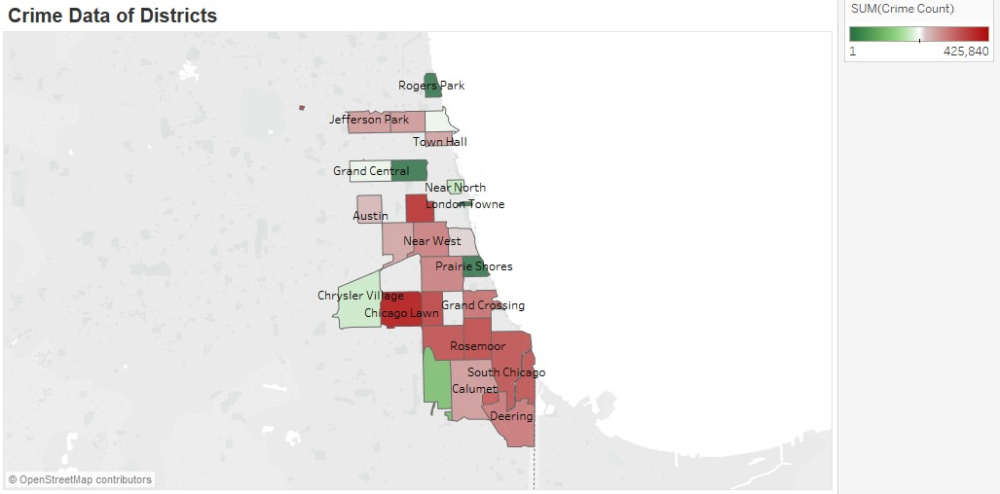

### ANALYSIS OF CRIME IN CHICAGO

**OBJECTIVE**

The Objective is to
highlight potential for improving Chicago policing through
Big Data Analytics using Data Analysis and visualization related to
crime in Chicago. Crime is an important and popular subject. But
interpreting crime data is tricky business, and developing coherent
narratives and useful metrics is even harder. Our analysis can be used
for daily operations in police department and can make significant
progress.  

“Big Data” does not just refer to the amount of data that is generated recently.  It is a new way of
approaching the way we analyze the world and needs to sit on a platform that allows for
near-constant exponential growth of data.

The reason for considering Chicago Crime is high man slaughter rate
which is 15.2 per 100,000 residents in Chicago while it is 4.0 for New
York and 6.5 for Los Angeles according to the FBI crime statistics.
Also, there is no decline in the past decade as compared to the other
two large cities, which have been on a slow declining slope.

**APPROACH**

With an aim to make Chicago Crime Dataset more useful to the Police
Department to fight against the increasing crime rate, following
approach is followed:

-   Analysis based on different district to identify the district with
    most crime rates

-   Analysis based on different crime types happening in the city to
    help police take appropriate actions against it.

-   Prediction whether the victim for Homicide is a Male or Female based
    on District, Race and Domestic violence field

<!-- -->

-   Identifying crime Hot Spots

-   Plotting of the crime areas on map

-   Analysis on Location Description – percentage of crime at a
    particular location (Street, Airport etc.)

-   Trending the crimes - trend line for crimes year wise.

-   Prediction of Crime Type based on Month, District, Community Area
    using Backpropagation Algorithm under Artificial Neural Network
    Classification

-   Used a related Homicide dataset for performing more specific
    analysis on Homicides happening in Chicago since Chicago had highest
    rate of Homicides.

**RESEARCH/FINDINGS**

-   Hadoop MapReduce can be efficiently used on such Crime Dataset to
    find out the statistics of the crime based on different fields

-   Also, Machine Learning Algorithms like Logistic Regression,
    Backpropagation algorithms can be used for making predictions like
    the Area where Crime can take place, Type of crime or Victim of a
    Particular race in a particular district.

-   Since Homicide rate in Chicago is highest, another Homicide dataset
    is used for in detail analysis of Homicide.

**OBSTACLES FACED AND RESOLUTION**

-   For performing prediction using Machine Learning algorithms, the
    dataset was required to be converted to Binary format. Since most of
    the fields have more than two values, conversion of such a huge
    dataset and multiple values into binary was an obstacle.

-   This problem was resolved by loading the dataset into a table and
    running hive query for conversion.

**RESULTS**

**Conclusion:** This analysis for the crimes based on crime category and
sub category on a yearly basis.This will be useful to Police Department
to analyse what type of crimes are more occurring in each year and they
can compare the occurrences of a particular crime in different years and
they can take appropriate measures to reduce.

**Conclusion:** This analysis is crime and arrest rate on a yearly
basis. This will we useful to Police Department to compare the crime and
arrest rates on a yearly basis.

**Conclusion:** This analysis is for the month where the crime rate is
high. So the police can more security actions on those months.

**Conclusion:** This analysis is for the day where the crime rate is
high and what is the peak time for crime occurrence. So the police can
more security actions on those months.

**Conclusion:** The above analysis shows the Homicide count for
districts. Police Department can use this data to ensure more safety to
be taken in which district to avoid more Homicides in that area.

**Conclusion:** This analysis for the crime type each district is most
vulnerable to. This will help the Police Department to concentrate on
the measures to be taken to curb that crime type.

**Conclusion:** This analysis for which crime type the arrest rate is
poor in each district. This will help the Police Department to analyse
the system why the arrest rate is poor for that crime type and take
appropriate measures on that.

**Conclusion:** The above analysis shows the time for a district when
the crime rate is highest. Police Department can use this data to decide
when and where patrolling is required.

**Conclusion:** This analysis for the crimes based on crime category and
sub category.This will be useful to Police Department to analyse what
type of crimes are more occurring and they can take appropriate measures
to reduce.

**Conclusion:** This analysis for the crimes involving gun and those
which are violent among them on a yearly basis. This can be used by
Police Department to keep an eye on crimes involving gun and which are
violent among them and compare their occurrences each year.

**Conclusion:** The above analysis shows the ethnicity of the gender who
are killed more. So, the police department can take measures on the
safety of these categories of population.

**Conclusion:** This analysis for analyzing the homicides by arrest rate
of criminals based on victim’s race and gender. This will help the
Police Department to emphasize on the investigation where the arrest
rates are poor based on victim’s gender and ethnicity.

**Conclusion:** The above analysis helps in understanding the gender
being victim for which major cause. Police Department can use this data
to spread the awareness and alert for safety.

**Conclusion:** The above analysis helps in understanding the age group
of population which are most victims for homicide.

**Conclusion:** This analysis for analyzing the homicides in each
district. This can be used by Police Department to concentrate on those
districts where homicides are more and find the reasons behind them and
take appropriate measures.

**FUTURE SCOPE**

-   Crime in one area causes surrounding areas to be more susceptible
    to crime. So we want perform analysis on areas of high crime which
    will experience more crime in the near future. This involves the use
    of a 'self-exciting' algorithm

-   Looking at incorporating Tweets into a model and use for sentimental
    analysis

-    Begin exploring and understanding Gaussian processes for predicting
    time series data

-   We want to use geospatial crime incident data to predict future hot
    spots for crime

    Using Spatial clustering algorithms

**REFERENCES**

-   **Dataset**

    https://data.cityofchicago.org/Public-Safety/Crimes-2001-to-present/ijzp-q8t2?q=crime

